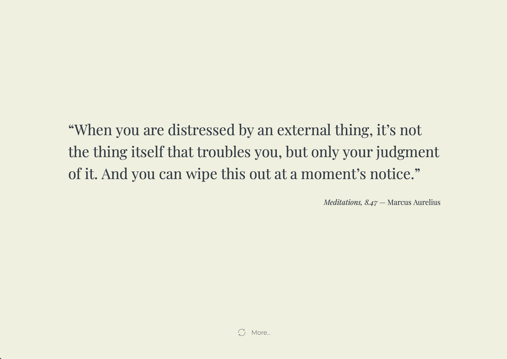
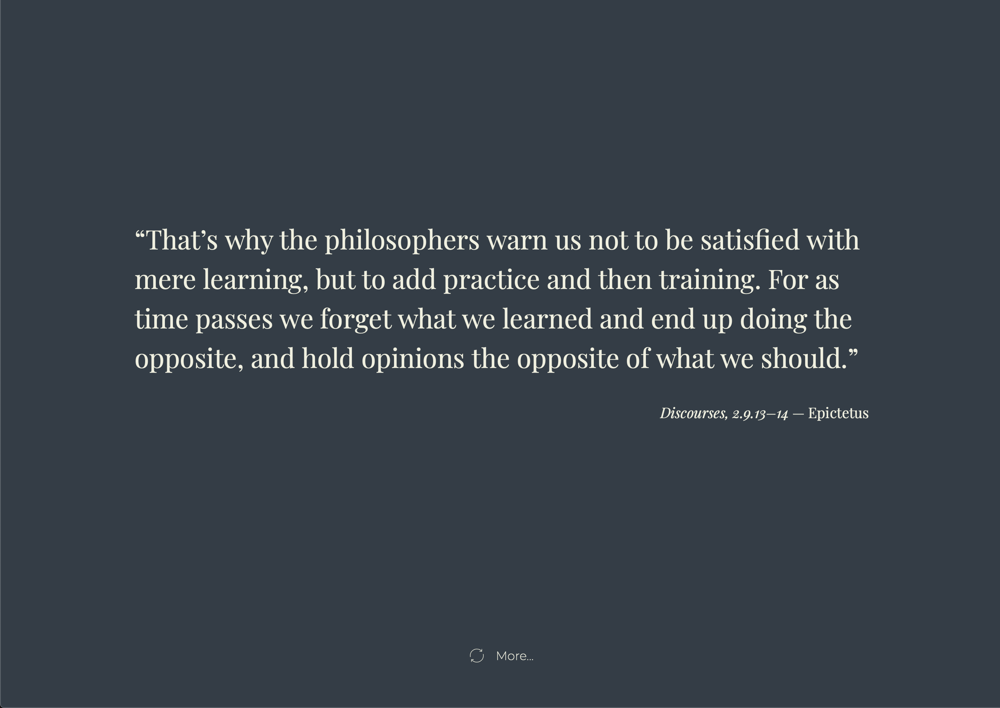

# stoic-homepage

The Stoic homepage. A minimalist homepage designed to display a new Stoics' quotes every time you go to.

## Customize

Go to the [customize page](https://stoic.thehomepage.io/customize.html) to customize the site theme and behavior.

### Theme

Choose between a light and a dark theme. 

### Quotes frequency

Choose between one quote per day or one quote every time you go to the homepage.

## Resources, about and all quotes

Beside the homepage and the customize one, you can find an [about page](https://stoic.thehomepage.io/about.html), a [resources page](https://stoic.thehomepage.io/resources.html) and an [all quotes page](https://stoic.thehomepage.io/quotes.html).

## Adding quotes

Feel free to add quotes using pull requests.
